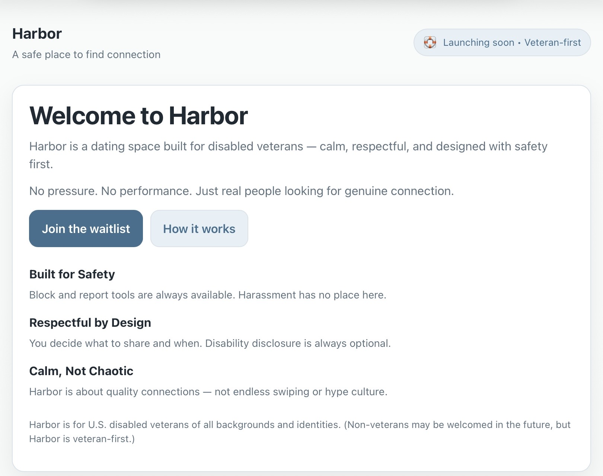
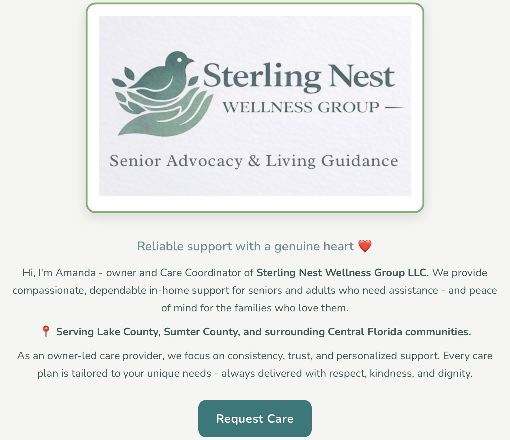

# Hi, I’m Edward 👋
> Building calm, people-centered digital experiences.

I build thoughtful, real-world projects focused on helping people feel supported, safe, and cared for.

---

## 🧭 Projects

### 🌊 Harbor
A safety-first dating experience for disabled veterans - designed to feel calm, respectful, and human.

[Visit Harbor](https://harborvets.app)

---

### 🏡 Sterling Nest Wellness
A home care and companion care website centered on dignity, reassurance, and support for individuals and families.

[Visit Sterling Nest](https://sterlingnestwellness.com)

---

## 💭 Build philosophy

I focus on building things that are:

- useful  
- trustworthy  
- calm  
- human  

I care about thoughtful design, real problems, and steady progress over hype.

---

## 🛠 Learning

- JavaScript fundamentals  
- Frontend development  
- Solo founder workflow  
- Turning ideas into live projects  

---

## 🤝 Open to

- thoughtful feedback  
- meaningful conversations  
- learning from others building real-world solutions  

---

Thanks for stopping by.
